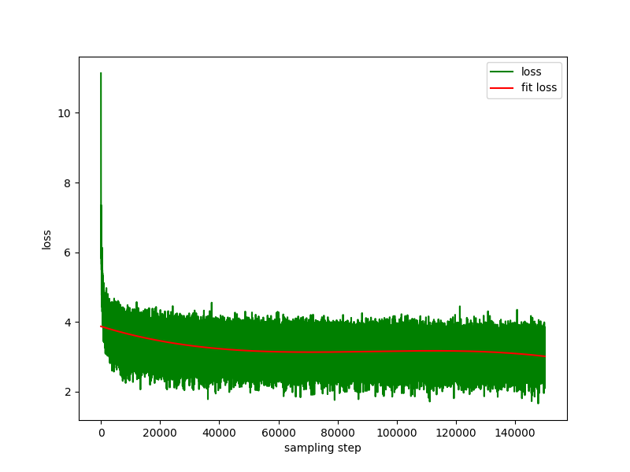

<div align="center">

# 中文对话模型0.2B Small Chinese Chat LM 0.2B  

中文  | [English](./README.en.md)  

</div>
 
# 一、介绍 
SCCLM项目的目标是从头开始训练一个中文对话小模型。整理生成式语言模型的训练流程，包括数据清洗、tokenizer训练、模型预训练、SFT指令微调、RLHF优化等。 

SCCLM为中文对话小模型，模型参数只有0.2B（算共享权重约210M），可以在最低4GB显存的机器进行预训练（`batch_size=1`，`fp16`或者` bf16`），`float16`加载、推理最少只需要512MB显存。 


- 公开所有预训练、SFT指令微调、DPO偏好优化数据集来源。
- 使用`Huggingface`NLP框架，包括`transformers`、`accelerate`、`trl`、`peft`等。
- 自实现`trainer`，支持单机单卡进行预训练、SFT微调。训练过程中支持在任意位置停止，及在任意位置继续训练。
- 预训练：整合为端到端的`Text-to-Text`预训练，非`mask`掩码预测预训练。
    - 开源所有数据清洗、数据集构造、数据集加载等流程；
    - `huggingface tokenizers`的tokenizer训练；
    - 预训练支持任意位置断点，可从断点处继续训练;
    - 大数据集（GB级别）流式加载、支持缓冲区数据打乱，不利用内存、硬盘作为缓存，有效减少内存、磁盘占用。配置`batch_size=1, max_len=320`下，最低支持在16GB内存+4GB显存的机器上进行预训练；
    - 训练日志记录。
- SFT微调：开源SFT数据集及数据处理过程。
    - 实现`trainer`支持prompt指令微调， 支持任意断点继续训练；
    - 支持`Huggingface trainer`的`sequence to sequence`微调；
    - 支持传统的低学习率，只训练decoder层的微调。
- 偏好优化：使用DPO进行全量偏好优化。
    - 支持使用`peft lora`进行偏好优化；
    - 支持模型合并，可将`Lora adapter`合并到原始模型中。
- 支持下游任务微调：[finetune_examples](./finetune_examples/info_extract/)给出**三元组信息抽取任务**的微调示例，微调后的模型对话能力仍在。

**最近更新**

<details close> 
<summary> <b>2024-01-31</b> </summary>
- 项目开源， 开放模型权重供下载。 <br/>
</details>


# 二、SCCLM-0.2B模型训练过程 

## 2.1 数据集
所有数据集均来自互联网公开的**单轮对话**数据集，经过数据清洗、格式化后保存为parquet文件。

### 2.1.1 预训练数据集
数据处理过程见`scripts/make_data.py`。主要数据集包括： 

1. 社区问答json版webtext2019zh-大规模高质量数据集，见：[nlp_chinese_corpus](https://github.com/brightmart/nlp_chinese_corpus)。
2. baike_qa2019百科类问答，见：[baike_qa2019](https://aistudio.baidu.com/datasetdetail/107726)。
3. 中国医药领域问答数据集，见：[Chinese-medical-dialogue-data]https://github.com/Toyhom/Chinese-medical-dialogue-data。
4. 知乎问答数据，见：[Zhihu-KOL]https://huggingface.co/datasets/wangrui6/Zhihu-KOL。
5. belle开源的指令训练数据，介绍：[BELLE](https://github.com/LianjiaTech/BELLE)，下载：[BelleGroup](https://huggingface.co/BelleGroup)，仅选取`Belle_open_source_1M`、`train_2M_CN`、及`train_3.5M_CN`中部分回答较短、不含复杂表格结构、翻译任务（没做英文词表）的数据，共370万行，清洗后剩余338万行。
6. 维基百科（Wikipedia）词条数据，将词条拼凑为提示语，百科的前`N`个词为回答，使用`202309`的百科数据。Wiki下载：[zhwiki](https://dumps.wikimedia.org/zhwiki/)，将下载的bz2文件转换为wiki.txt参考：[WikiExtractor](https://github.com/apertium/WikiExtractor)。 

数据示例：
```json
{
    "prompt": "对于花园街，你有什么了解或看法吗？",
    "response": "花园街（是香港油尖旺区的一条富有特色的街道，位于九龙旺角东部，北至界限街，南至登打士街，与通菜街及洗衣街等街道平行。现时这条街道是香港著名的购物区之一。位于亚皆老街以南的一段花园街，也就是\"波鞋街\"整条街约150米长，有50多间售卖运动鞋和运动用品的店舖。旺角道至太子道西一段则为排档区，售卖成衣、蔬菜和水果等。花园街一共分成三段。明清时代，花园街是芒角村栽种花卉的地方。此外，根据历史专家郑宝鸿的考证：花园街曾是1910年代东方殷琴拿烟厂的花园。纵火案。自2005年起，花园街一带最少发生5宗纵火案，当中4宗涉及排档起火。2010年。2010年12月6日，花园街222号一个卖鞋的排档于凌晨5时许首先起火，浓烟涌往旁边住宅大厦，消防接报4"
}
```
### 2.1.2 SFT微调数据集
SFT微调和DPO优化数据集见下文。
SFT数据集全部来自[BELLE](https://github.com/LianjiaTech/BELLE)。SFT数据集分别为：[generated_chat_0.4M](https://huggingface.co/datasets/BelleGroup/generated_chat_0.4M)、[train_0.5M_CN](https://huggingface.co/datasets/BelleGroup/train_0.5M_CN)和[train_2M_CN](https://huggingface.co/datasets/BelleGroup/train_2M_CN)。

数据示例：
```json
{
    "prompt": "解释什么是欧洲启示录",
    "response": "欧洲启示录（The Book of Revelation）是新约圣经的最后一卷书，也被称为《启示录》、《默示录》或《约翰默示录》。这本书从宗教的角度描述了世界末日的来临，以及上帝对世界的审判和拯救。 书中的主题包括来临的基督的荣耀，上帝对人性的惩罚和拯救，以及魔鬼和邪恶力量的存在。欧洲启示录是一个充满象征和暗示的文本，对于解读和理解有许多不同的方法和观点。"
}
```

### 2.1.3 DPO优化数据集
1. 微调的`chosen`文本来自数据集[alpaca-gpt4-data-zh](https://huggingface.co/datasets/c-s-ale/alpaca-gpt4-data-zh)，拒绝文本`rejected`来自SFT微调1个epoch后的模型输出
2. 数据集：[huozi_rlhf_data_json](https://huggingface.co/datasets/Skepsun/huozi_rlhf_data_json)
3. 数据集：[rlhf-reward-single-round-trans_chinese](https://huggingface.co/datasets/beyond/rlhf-reward-single-round-trans_chinese)

数据示例：
```json
    {
        "prompt": "为给定的产品创建一个创意标语。，输入：可重复使用的水瓶。",
        "chosen": "\"保护地球，从拥有可重复使用的水瓶开始！\"",
        "rejected": "\"让你的水瓶成为你的生活伴侣，使用可重复使用的水瓶，让你的水瓶成为你的伙伴\""
    }
```

## 2.2 模型
T5模型（Text-to-Text Transfer Transformer），详情见论文: [Exploring the Limits of Transfer Learning with a Unified Text-to-Text Transformer](https://arxiv.org/abs/1910.10683)。

模型源码来自huggingface，见：[T5ForConditionalGeneration](https://github.com/huggingface/transformers/blob/main/src/transformers/models/t5/modeling_t5.py#L1557)。

模型配置见[model_config.json](https://huggingface.co/charent/ChatLM-mini-Chinese/blob/main/config.json)，官方的`T5-base`：`encoder layer`和`decoder layer `均为为12层，本项目这两个参数修改为10层。 

模型参数：0.2B。词表大小：29298，仅包含中文和少量英文。

## 2.3 训练过程
硬件：
```bash
CPU: 28 vCPU Intel(R) Xeon(R) Gold 6330 CPU @ 2.00GHz
内存：128 GB
显卡：NVIDIA GeForce RTX 4090 Ti 24GB * 1
```
1. **tokenizer 训练**： 现有`tokenizer`训练库存在大语料时存在OOM问题，加载1000万条数据，大约需要100GB内存，可以根据硬件情况，选取合适数量的数据进行训练。

2. **Text-to-Text 预训练**：学习率为`1e-4`到`5e-3`的动态学习率，预训练时间为8天。训练损失： 

 

3. **prompt监督微调（SFT）**：使用`belle`指令训练数据集（指令和回答长度都在512以下），学习率为`1e-7`到`5e-5`的动态学习率，微调时间2天。微调损失： 
   
 

1. **dpo直接偏好优化**：数据集[alpaca-gpt4-data-zh](https://huggingface.co/datasets/c-s-ale/alpaca-gpt4-data-zh)作为`chosen`文本，使用步骤`2`中SFT模型对数据集中的prompt做`generate`，得到`rejected`文本，dpo全量偏好优化，学习率`le-5`，半精度`fp16`,共`2`个`epoch`，耗时3h。dpo损失： 
 
 

## 2.4 对话效果展示
### 2.4.1 stream chat
默认使用`huggingface transformers`的 `TextIteratorStreamer`实现流式对话，只支持`greedy search`，如果需要`beam sample`等其他生成方式，请将`cli_demo.py`的`stream_chat`参数修改为`False`。


### 2.4.2 对话展示


存在问题：预训练数据集只有600多万，模型参数也仅0.2B，会有答非所问、废话生成器的情况。

# 三、📑使用说明

## 3.1 快速开始：
```python
from transformers import AutoTokenizer, AutoModelForSeq2SeqLM
import torch

model_id = 'charent/ChatLM-mini-Chinese'
device = torch.device('cuda' if torch.cuda.is_available() else 'cpu')

tokenizer = AutoTokenizer.from_pretrained(model_id)
model = AutoModelForSeq2SeqLM.from_pretrained(model_id, trust_remote_code=True).to(device)

txt = '如何评价Apple这家公司？'

encode_ids = tokenizer([txt])
input_ids, attention_mask = torch.LongTensor(encode_ids['input_ids']), torch.LongTensor(encode_ids['attention_mask'])

outs = model.my_generate(
    input_ids=input_ids.to(device),
    attention_mask=attention_mask.to(device),
    max_seq_len=256,
    search_type='beam',
)

outs_txt = tokenizer.batch_decode(outs.cpu().numpy(), skip_special_tokens=True, clean_up_tokenization_spaces=True)
print(outs_txt[0])
```
```txt
Apple是一家专注于设计和用户体验的公司，其产品在设计上注重简约、流畅和功能性，而在用户体验方面则注重用户的反馈和使用体验。作为一家领先的科技公司，苹果公司一直致力于为用户提供最优质的产品和服务，不断推陈出新，不断创新和改进，以满足不断变化的市场需求。
在iPhone、iPad和Mac等产品上，苹果公司一直保持着创新的态度，不断推出新的功能和设计，为用户提供更好的使用体验。在iPad上推出的iPad Pro和iPod touch等产品，也一直保持着优秀的用户体验。
此外，苹果公司还致力于开发和销售软件和服务，例如iTunes、iCloud和App Store等，这些产品在市场上也获得了广泛的认可和好评。
总的来说，苹果公司在设计、用户体验和产品创新方面都做得非常出色，为用户带来了许多便利和惊喜。

```

## 3.2 从克隆仓库代码开始

本项目模型为`TextToText`模型，在预训练阶段、SFT阶段、RLFH阶段的`prompt`、`response`等字段，请务必加上`[EOS]`句子结束标记。    

### 3.2.1 克隆项目：
```bash
git clone --depth 1 https://github.com/paineliu/SCCLM.git

cd SCCLM
```
### 3.2.2 安装依赖 

本项目推荐使用`python 3.11`。  

pip安装：
```bash
pip install -r ./requirements.txt
``` 
conda安装：
```bash
conda install --yes --file ./requirements.txt
```

### 3.2.3 下载预训练模型及模型配置文件

用`git`命令从`Hugging Face Hub`下载模型权重及配置文件，需要先安装[Git LFS](https://docs.github.com/zh/repositories/working-with-files/managing-large-files/installing-git-large-file-storage)，然后运行: 

```bash 
# 使用git命令下载huggingface模型，先安装[Git LFS]，否则下载的模型文件不可用
git clone --depth 1 https://huggingface.co/charent/ChatLM-mini-Chinese

mv ChatLM-mini-Chinese model_save
```

也可以直接从`Hugging Face Hub`仓库[ChatLM-Chinese-0.2B](https://huggingface.co/charent/ChatLM-mini-Chinese)手工下载，将下载的文件移动到`model_save`目录下即可。

## 3.3 Tokenizer训练

原本打算直接用现成的`tokenizer`库训练的（如`sentencepiece`），但是数据集一大就容易OOM。另外预训练数据集各个领域的语料不平衡，会产生很多不必要的合并。最后使用`jieba`分词对所有的预训练语料切词后统计词频，只保留出现1500次以上的字、词，参照`PreTrainedTokenizerFast`的`BPE model`的保存格式，构造`tokenzier`，最后转换为`PreTrainedTokenizerFast`。核心代码如下，详细的处理过程见`utils/train_tokenizer.py`。

```python
# 构造merge数组
words_merge_list = []
for word in words_dict.keys():
    n = len(word)
    if n >= 2:
        # a, b切分12345示例： 1 2345,  12 345,   123 45,   1234 5
        for i in range(1, n):
            a, b = ''.join(word[0: i]), ''.join(word[i: ])

            if a in words_dict and b in words_dict:
                words_merge_list.append((a, b))
```
本项目还提供了使用预训练模型自带的`tokenizer`根据自己的语料重新训练`tokenizer`的例子，见`train_tokenizer.ipynb`。注意，重新训练`tokenizer`后，预训练模型的权重将无法使用，需要重新训练模型权重，因为`token`对应的`id`变了。

## 3.4 Text-to-Text 预训练 

1. 预训练数据集示例

   
2. jupyter-lab 或者 jupyter notebook:  

    见文件`train.ipynb`，推荐使用jupyter-lab，避免考虑与服务器断开后终端进程被杀的情况。 

3. 控制台： 

    控制台训练需要考虑连接断开后进程被杀的，推荐使用进程守护工具`Supervisor`或者`screen`建立连接会话。

    首先要配置`accelerate`，执行以下命令， 根据提示选择即可，参考`accelerate.yaml`，*注意：DeepSpeed在Windows安装比较麻烦*。
    ```bash
    accelerate config
    ```

    开始训练，如果要使用工程提供的配置请在下面的命令`accelerate launch`后加上参数`--config_file ./accelerate.yaml`，*该配置按照单机2xGPU配置。* 

    *预训练有两个脚本，本项目实现的trainer对应`train.py`，huggingface实现的trainer对应`pre_train.py`，用哪个都可以，效果一致。本项目实现的trainer训练信息展示更美观、更容易修改训练细节（如损失函数，日志记录等），均支持断点继续训练，本项目实现的trainer支持在任意位置断点后继续训练，按`ctrl+c`退出脚本时会保存断点信息。* 

    单机单卡：
    ```bash
    # 本项目实现的trainer
    accelerate launch ./train.py train

    # 或者使用 huggingface trainer
    python ./chatbot/train.py
    ```

    单机多卡：
    `2`为显卡数量，请根据自己的实际情况修改。
    ```bash
    # 本项目实现的trainer
    accelerate launch --multi_gpu --num_processes 2 ./train.py train

    # 或者使用 huggingface trainer
    accelerate launch --multi_gpu --num_processes 2 pre_train.py
    ```

    从断点处继续训练：
    ```bash
    # 本项目实现的trainer
    accelerate launch --multi_gpu --num_processes 2 ./train.py train --is_keep_training=True

    # 或者使用 huggingface trainer
    # 需要在`pre_train.py`中的`train`函数添加`resume_from_checkpoint=True`
    accelerate launch --multi_gpu --num_processes 2 pre_train.py
    ```

## 3.5 SFT微调 
微调细节见`model/trainer.py`下的`train`方法, `is_finetune`设置为`True`时，将进行微调，微调默认会冻结embedding层和encoder层，只训练decoder层。如需要冻结其他参数，请自行调整代码。 

运行SFT微调：
``` bash
# 本项目实现的trainer， 添加参数`--is_finetune=True`即可, 参数`--is_keep_training=True`可从任意断点处继续训练
accelerate launch --multi_gpu --num_processes 2 ./train.py --is_finetune=True

# 或者使用 huggingface trainer, 多GPU请用accelerate launch --multi_gpu --num_processes gpu个数 sft_train.py
python sft_train.py
```

## 3.6 RLHF（强化学习人类反馈优化方法）

偏好方法这里介绍常见的两种：PPO和DPO，具体实现请自行搜索论文及博客。

1.  PPO方法（近似偏好优化,Proximal Policy Optimization）  
    步骤1：使用微调数据集做有监督微调（SFT， Supervised Finetuning）。   
    步骤2：使用偏好数据集（一个prompt至少包含2个回复，一个想要的回复，一个不想要的回复。多个回复可以按照分数排序，最想要的分数最高）训练奖励模型（RM， Reward Model）。可使用`peft`库快速搭建Lora奖励模型。   
    步骤3：利用RM对SFT模型进行有监督PPO训练，使得模型满足偏好。   

2.  使用DPO（直接偏好优化，Direct Preference Optimization）微调（**本项目采用DPO微调方法，比较节省显存**）
    在获得SFT模型的基础上，无需训练奖励模型，取得正向回答（chosen）和负向回答（rejected）即可开始微调。
    
    dpo数据集处理过程见`utils/dpo_data_process.py`。
    


运行偏好优化：
``` bash
#  多GPU请用accelerate launch --multi_gpu --num_processes gpu个数 dpo_train.py
python dpo_train.py
```

## 3.7 推理 
确保`model_save`目录下有以下文件，这些文件都可以在`Hugging Face Hub`仓库[ChatLM-Chinese-0.2B](https://huggingface.co/charent/ChatLM-mini-Chinese)中找到：
```bash
ChatLM-mini-Chinese
├─model_save
|  ├─config.json
|  ├─configuration_chat_model.py
|  ├─generation_config.json
|  ├─model.safetensors
|  ├─modeling_chat_model.py
|  ├─special_tokens_map.json
|  ├─tokenizer.json
|  └─tokenizer_config.json
```

1. 控制台运行：
```bash
python cli_demo.py
```

2. API调用
```bash
python api_demo.py
```

API调用示例：
```bash
curl --location '127.0.0.1:8812/api/chat' \
--header 'Content-Type: application/json' \
--header 'Authorization: Bearer Bearer' \
--data '{
    "input_txt": "感冒了要怎么办"
}'
```


## 3.8 下游任务微调

这里以文本中三元组信息为例，做下游微调。该任务的传统深度学习抽取方法见仓库[pytorch_IE_model](https://github.com/charent/pytorch_IE_model)。抽取出一段文本中所有的三元组，如句子`《写生随笔》是冶金工业2006年出版的图书，作者是张来亮`，抽取出三元组`(写生随笔,作者,张来亮)`和`(写生随笔,出版社,冶金工业)`。 

原始数据集为：[百度三元组抽取数据集](https://aistudio.baidu.com/datasetdetail/11384)。加工得到的微调数据集格式示例：
```json
{
    "prompt": "请抽取出给定句子中的所有三元组。给定句子：《家乡的月亮》是宋雪莱演唱的一首歌曲，所属专辑是《久违的哥们》",
    "response": "[(家乡的月亮,歌手,宋雪莱),(家乡的月亮,所属专辑,久违的哥们)]"
}
```

可以直接使用`sft_train.py`脚本进行微调，脚本[finetune_IE_task.ipynb](./finetune_examples/info_extract/finetune_IE_task.ipynb)里面包含详细的解码过程。训练数据集约`17000`条，学习率`5e-5`，训练epoch`5`。微调后其他任务的对话能力也没有消失。


微调效果：
将`百度三元组抽取数据集`公开的`dev`数据集作为测试集，对比传统方法[pytorch_IE_model](https://github.com/charent/pytorch_IE_model)。

|          模型            |   F1分数  |  精确率P |  召回率R |
|          :---            |  :----:  |    :---:  |  :---:   |
| ChatLM-Chinese-0.2B微调  |   0.74    |  0.75   |  0.73    |
| ChatLM-Chinese-0.2B无预训练| 0.51    |   0.53   | 0.49    |
| 传统深度学习方法          |   0.80    |  0.79   |  80.1    |

备注：`ChatLM-Chinese-0.2B无预训练`指直接初始化随机参数，开始训练，学习率`1e-4`，其他参数和微调一致。

# 四、🎓引用
如果你觉得本项目对你有所帮助，欢迎引用。
```conf
@misc{Charent2023,
    author={Charent Chen},
    title={A small chinese chat language model with 0.2B parameters base on T5},
    year={2023},
    publisher = {GitHub},
    journal = {GitHub repository},
    howpublished = {\url{https://github.com/charent/ChatLM-mini-Chinese}},
}
```

# 五、🤔其他事项
本项目不承担开源模型和代码导致的数据安全、舆情风险或发生任何模型被误导、滥用、传播、不当利用而产生的风险和责任。

项目主要参考了ChatLM-mini-Chinese项目：
```conf
@misc{Charent2023,
    author={Charent Chen},
    title={A small chinese chat language model with 0.2B parameters base on T5},
    year={2023},
    publisher = {GitHub},
    journal = {GitHub repository},
    howpublished = {\url{https://github.com/charent/ChatLM-mini-Chinese}},
}
```

<!-- # 提示
```bash
# 导出项目依赖的包：
pipreqs --encoding "utf-8" --force
``` -->

